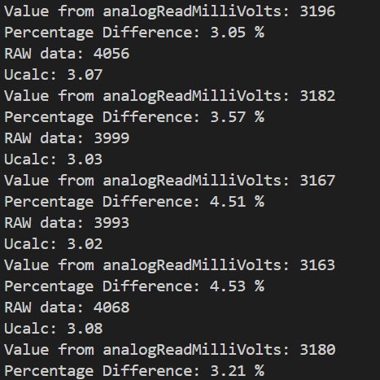
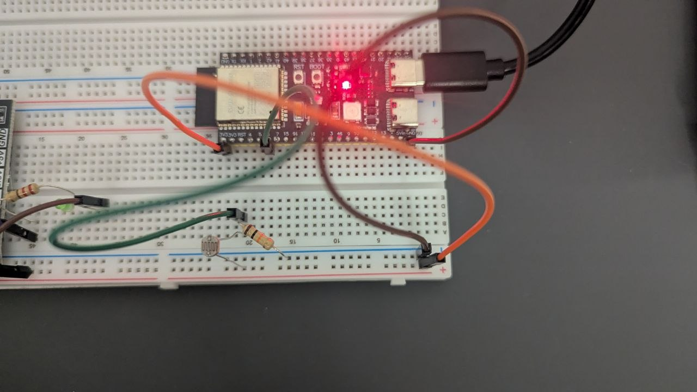

# AnalogRead

## Description

Light level measurement using an LDR (photoresistor) and the ESP32-S3 ADC. The program reads the analog sensor value and compares two voltage calculation methods.

### How It Works

1. Reads the raw 12-bit ADC value (0–4095) from GPIO 6.
2. Calculates voltage manually: `V = raw * (Vref / ADC_max)` with Vref = 3.1 V.
3. Reads the voltage using the built-in `analogReadMilliVolts()` function (which applies ESP32 calibration curves).
4. Computes the percentage difference between the two methods.
5. Outputs all values over serial at 100 ms intervals.

### Serial Output Example

```
RAW data: 2048
Ucalc: 1.55
Value from analogReadMilliVolts: 1580
Percentage Difference: 1.91 %
```





## Hardware

| Component | Pin | Description |
|-----------|-----|-------------|
| LDR (photoresistor) | GPIO 6 | Analog light sensor via voltage divider |

## Build

- **Platform:** espressif32
- **Board:** esp32-s3-devkitc-1
- **Framework:** Arduino
- **Monitor speed:** 115200 baud
