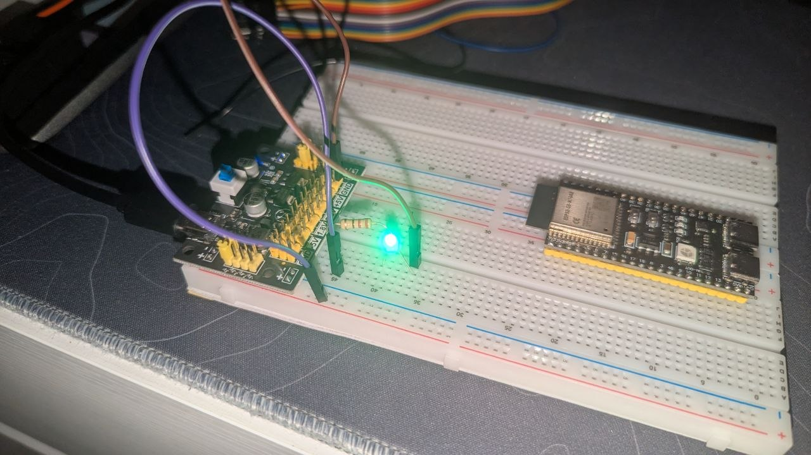

# Hello World

## Description

First introduction to the ESP32-S3 development board. Basic breadboard setup with an LED connected to the microcontroller, verifying hardware connectivity and the development toolchain.

